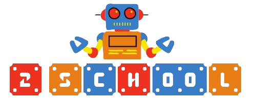

<p align="center">
  
</p>

# 2School

2School is an open-source electronic-school logbook which can be used by teachers and students to monitor day-to-day school activity, including homeworks and presence information.

## 🔧 Installation

The project is divided into two main folders: fe (front-end) and be (back-end).

To run both, nodeJS installation is required.

To deploy the front-end on your local machine, run the following command inside the fe directory:

```bash
  npm run start
```

To deploy the back-end, run the following command inside the be directory:

```bash
  npm run dev
```

## 📖 Documentation

2School uses Swagger for documentation of backend endpoints.
The documentation is always loaded and available by navigating to the /docs endpoint of the backend.

## 🔎 Features

- Different roles for users: Teacher, Student, Admin
- Modern and responsive design by using ant framework
- Upload and retrieval of homework attachments through dedicated cloud services
- Dedicated management panel for Admin users
- More to come..